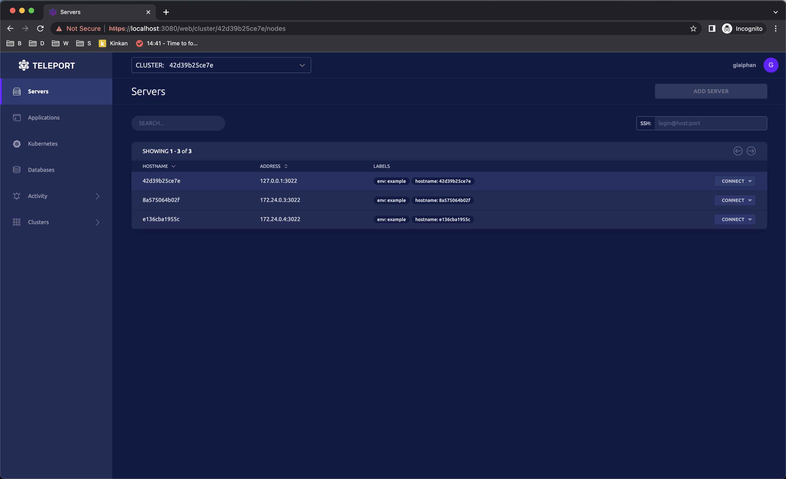
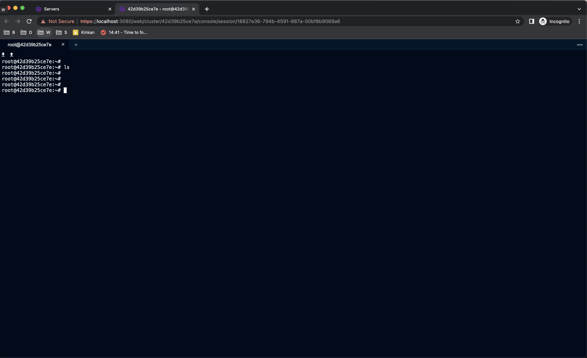
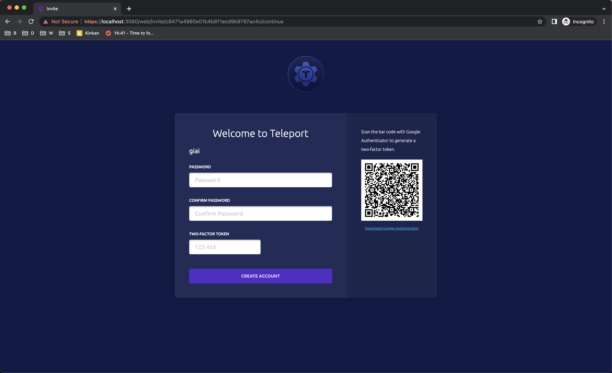

# Teleport - The Open Infrastructure Access Platform

## Teleport centralized control access across service

The open source access platform used by DevSecOps teams for SSH, Kubernetes, databases, internal web applications and Windows. Teleport prevents phishing by relying on biometrics and machine identity, stops attacker pivots with the Zero Trust architecture, is compatible with everything you have, comes as a cloud service or a self-hosted option and doesn't get in the way of an engineer's productivity.

- Example control access container services by Teleport cluster



- Example access ssh from Teleport



## Deployment

Assuming that Docker is installed, simply execute the following command to build and run the Docker Containers:

```
docker compose -f docker-compose.yaml up
```

To shutdown Docker Containers, execute the following command:

```
docker compose -f docker-compose.yaml down
```

## Config authentication account for users

Attach to teleport-server server, then create a user:

```
tctl users add --roles=... --logins=user,ubuntu,ec2-user name-user
```

Setup password and two factor authentication:


